<p align="center">
  
</p>

# 🏢 afk-company

> **A one-person company that keeps running while the CEO is away for two months.**

[한국어 README](README.ko.md)

Write a task file. Check `doctor.py` says ✅. Board your flight. **Your company clocks in every 30 minutes without you** — and the only thing it ever asks of you is a tap on [approve].

This is **not** another multi-agent orchestration framework. It's the opposite: a minimal, **absence-first** unattended operations stack on top of Claude Code. Every design decision starts from one question — *what breaks when you're not there?*

<p align="center">
<picture>
  <source media="(prefers-color-scheme: dark)" srcset=".github/assets/architecture-dark.svg">
  
</picture>
</p>

## Why this is different

Agent frameworks compete on how much the AI *can* do.
afk-company starts from the failure modes of leaving one alone:

| How it dies while you're away | What afk-company does |
|---|---|
| AI goes rogue, invents work | The runner never invents tasks. No task file, no execution |
| Token bill explosion | Hard daily spend ceiling. Over budget → the company simply rests |
| Plausible-looking progress on ambiguous work | One `BLOCKED:` marker halts the task into an approval queue |
| Process dies silently | Heartbeat file + a daily proof-of-life report |
| No idea what happened last month | Every state change is a git commit. The repo *is* the audit log |
| Money / outbound / contract accidents | Tier 3 forbidden zone: the tools simply aren't granted |

## The 3-tier autonomy model

- **Tier 1 — unattended**: deterministic, verifiable, reversible work (batch processing, monitoring, collection)
- **Tier 2 — drafts only**: email replies, applications, proposals. Files get created; **the send button is never automated**
- **Tier 3 — forbidden**: payments, contracts, outbound sends, deploys. Enforced by the tool whitelist, not by the prompt. Prompts can be talked around; a tool that isn't there can't be used

## FUSION model routing (v0.5)

Away-from-keyboard cost control isn't just a spend ceiling — it's sending each task to the cheapest model that can do it. Grounded in [Cognition's Devin Fusion measurements](https://cognition.com/blog/devin-fusion): mechanical work delegates down with quality held (-62% on test runs); judgment work degrades when delegated.

| Task | Default model | Why |
|---|---|---|
| `tier: 1` (deterministic, verifiable) | `haiku` | measurement-class work — cheap models do it flawlessly |
| `tier: 2` (drafts for human review) | `sonnet` | production-class writing, a human approves it anyway |
| explicit `model:` in frontmatter | whatever you wrote | the contract always wins |

Every run's model lands in `logs/spend_ledger.jsonl`, so you can audit the routing's real savings from your phone:

```bash
jq -r '[.model, .cost_usd] | @tsv' logs/spend_ledger.jsonl | sort | awk '{s[$1]+=$2} END {for (m in s) print m, s[m]}'
```

Configure defaults in `company.json` → `"tier_models": {"1": "haiku", "2": "sonnet"}`.

## Quick start

```bash
git clone https://github.com/YOU/afk-company && cd afk-company
./install.sh                      # registers launchd jobs + runs diagnostics
vi config/company.json            # telegram token, daily budget
cp departments/ocr-batch.example.md tasks/pending/my-first-task.md
python3 bin/runner.py             # one manual run to verify
python3 bin/doctor.py             # all ✅? board your flight ✈️
```

## A task file is an employee

One task = one markdown file. The frontmatter is its employment contract:

```markdown
---
id: nightly-batch
tier: 1
schedule: daily          # once | daily | weekly
model: haiku             # optional — omitted? tier decides (see FUSION routing)
allowed_tools: "Read,Write,Bash(python3 *)"   # physically cannot use anything else
max_turns: 40
timeout_minutes: 60
---
# What to do
...
## Done condition  → print `DONE: <one-line summary>` as the last line
## Block condition → print `BLOCKED: <one-line reason>` — never push through ambiguity
```

## The away-from-keyboard loop

1. One Telegram morning report: ✅ done / 🔒 awaiting approval / 💸 spend / ❤️ alive
2. The moment a task blocks, you get a push with **[✅ approve] [❌ reject]** inline buttons — tap one, done
3. Telegram *is* the command channel: `/status`, `/approve <id>`, `/reject <id> [why]`, `/task <anything>` to hire a new task from your phone, `/budget <usd>`
4. GitHub mobile remains the fallback approval desk (edit files in `tasks/blocked/`)

## This repo runs itself

Since 2026-07-04 this repository is a **live afk-company instance**: a launchd runner on a Mac mini picks up the task files you see in `tasks/`, executes them on a schedule, and commits every state change here. The commit history *is* the operational record — `run start:` / `done:` / `blocked:` messages are written by the runner, not by a human. (One early lesson is already in the history: the test suite once contaminated the live install, which is why `verify.sh` now runs fully sandboxed.)

## Honest limitations

- Two months of **fully** unattended operation is not a real thing. OAuth expires, CLIs update, machines reboot. The goal isn't "zero-touch" — it's **shrinking management to 5 minutes a day from a phone**.
- macOS + launchd (Linux port is a systemd-timer swap away — PRs welcome).
- Designed around a Claude Code subscription. If you wire a raw API key, double-check the budget ceiling first.

## Prior art & credits

- **NaverMadCat** — Shin Dongmin's NAVER Engineering Day 2026 talk ("Building a company on Claude Code"): the company metaphor, lifecycle hooks, git-as-sync
- **PAI** by Daniel Miessler — personal AI infrastructure as a discipline

The difference: those systems make you stronger **while you're at the keyboard**. This one keeps the lights on **when you're not**.

## License

MIT
